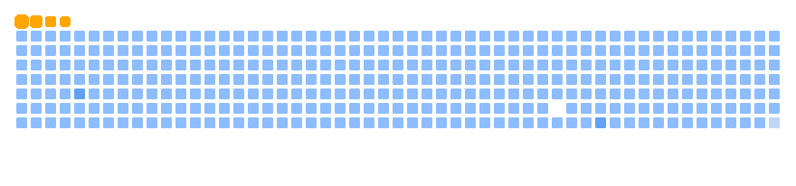

---

  

<h1 align="center">
  
</h1>

  

---

<h2 align="left">💡About Me</h2>
I’m a B.Tech student in Computer Science Engineering, aspiring to be a Full-Stack Developer. I love learning new technologies and currently exploring frameworks like React and Node.js. Passionate about collaboration and open-source contributions, I’m eager to connect and grow within the tech community. Feel free to check out my projects and reach out!

---

<h2 align="left">🎤Skills</h2>

         

---

<h2 align="left">📲Socials</h2>

---

<h2 align="left">⌛ My Contributions ⏳</h2>

  <picture>
    <source media="(prefers-color-scheme: dark)" srcset="output/github-contribution-grid-snake-dark.svg" />
    <source media="(prefers-color-scheme: light)" srcset="output/github-contribution-grid-snake.svg" />
    
  </picture>

